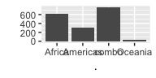

cm012 Exercises: Factors
================

`forcats` package comes loaded with `tiyverse`:

``` r
suppressPackageStartupMessages(library(tidyverse))
library(gapminder)
```

Factors
=======

Resources
---------

-   Exercises are based on <http://stat545.com/block029_factors.html> and <http://r4ds.had.co.nz/factors.html>. Some content was taken from the former.

Intro to Factors
----------------

What is a factor? A "truly categorical" variable. You can think of it as a vector that:

-   has character entries on the surface
-   are integers underneath
-   has **levels**

Examples of Base R's obsession with coercing to factors:

``` r
data.frame(x=c("A", "B")) %>% 
  str()
```

    ## 'data.frame':    2 obs. of  1 variable:
    ##  $ x: Factor w/ 2 levels "A","B": 1 2

``` r
lotr1 <- "https://raw.githubusercontent.com/jennybc/lotr-tidy/master/data/The_Fellowship_Of_The_Ring.csv" %>% 
  read.csv()
lotr2 <- "https://raw.githubusercontent.com/jennybc/lotr-tidy/master/data/The_Return_Of_The_King.csv" %>% 
  read.csv()
str(lotr1)
```

    ## 'data.frame':    3 obs. of  4 variables:
    ##  $ Film  : Factor w/ 1 level "The Fellowship Of The Ring": 1 1 1
    ##  $ Race  : Factor w/ 3 levels "Elf","Hobbit",..: 1 2 3
    ##  $ Female: int  1229 14 0
    ##  $ Male  : int  971 3644 1995

``` r
str(lotr2)
```

    ## 'data.frame':    3 obs. of  4 variables:
    ##  $ Film  : Factor w/ 1 level "The Return Of The King": 1 1 1
    ##  $ Race  : Factor w/ 3 levels "Elf","Hobbit",..: 1 2 3
    ##  $ Female: int  183 2 268
    ##  $ Male  : int  510 2673 2459

Examples of problems encountered with factors. (ideas came from [R Bloggers](https://www.r-bloggers.com/factors-are-not-first-class-citizens-in-r/))

``` r
iris %>% 
  mutate(Species = ifelse(Species == "versicolor", "vers", Species))
```

    ##     Sepal.Length Sepal.Width Petal.Length Petal.Width Species
    ## 1            5.1         3.5          1.4         0.2       1
    ## 2            4.9         3.0          1.4         0.2       1
    ## 3            4.7         3.2          1.3         0.2       1
    ## 4            4.6         3.1          1.5         0.2       1
    ## 5            5.0         3.6          1.4         0.2       1
    ## 6            5.4         3.9          1.7         0.4       1
    ## 7            4.6         3.4          1.4         0.3       1
    ## 8            5.0         3.4          1.5         0.2       1
    ## 9            4.4         2.9          1.4         0.2       1
    ## 10           4.9         3.1          1.5         0.1       1
    ## 11           5.4         3.7          1.5         0.2       1
    ## 12           4.8         3.4          1.6         0.2       1
    ## 13           4.8         3.0          1.4         0.1       1
    ## 14           4.3         3.0          1.1         0.1       1
    ## 15           5.8         4.0          1.2         0.2       1
    ## 16           5.7         4.4          1.5         0.4       1
    ## 17           5.4         3.9          1.3         0.4       1
    ## 18           5.1         3.5          1.4         0.3       1
    ## 19           5.7         3.8          1.7         0.3       1
    ## 20           5.1         3.8          1.5         0.3       1
    ## 21           5.4         3.4          1.7         0.2       1
    ## 22           5.1         3.7          1.5         0.4       1
    ## 23           4.6         3.6          1.0         0.2       1
    ## 24           5.1         3.3          1.7         0.5       1
    ## 25           4.8         3.4          1.9         0.2       1
    ## 26           5.0         3.0          1.6         0.2       1
    ## 27           5.0         3.4          1.6         0.4       1
    ## 28           5.2         3.5          1.5         0.2       1
    ## 29           5.2         3.4          1.4         0.2       1
    ## 30           4.7         3.2          1.6         0.2       1
    ## 31           4.8         3.1          1.6         0.2       1
    ## 32           5.4         3.4          1.5         0.4       1
    ## 33           5.2         4.1          1.5         0.1       1
    ## 34           5.5         4.2          1.4         0.2       1
    ## 35           4.9         3.1          1.5         0.2       1
    ## 36           5.0         3.2          1.2         0.2       1
    ## 37           5.5         3.5          1.3         0.2       1
    ## 38           4.9         3.6          1.4         0.1       1
    ## 39           4.4         3.0          1.3         0.2       1
    ## 40           5.1         3.4          1.5         0.2       1
    ## 41           5.0         3.5          1.3         0.3       1
    ## 42           4.5         2.3          1.3         0.3       1
    ## 43           4.4         3.2          1.3         0.2       1
    ## 44           5.0         3.5          1.6         0.6       1
    ## 45           5.1         3.8          1.9         0.4       1
    ## 46           4.8         3.0          1.4         0.3       1
    ## 47           5.1         3.8          1.6         0.2       1
    ## 48           4.6         3.2          1.4         0.2       1
    ## 49           5.3         3.7          1.5         0.2       1
    ## 50           5.0         3.3          1.4         0.2       1
    ## 51           7.0         3.2          4.7         1.4    vers
    ## 52           6.4         3.2          4.5         1.5    vers
    ## 53           6.9         3.1          4.9         1.5    vers
    ## 54           5.5         2.3          4.0         1.3    vers
    ## 55           6.5         2.8          4.6         1.5    vers
    ## 56           5.7         2.8          4.5         1.3    vers
    ## 57           6.3         3.3          4.7         1.6    vers
    ## 58           4.9         2.4          3.3         1.0    vers
    ## 59           6.6         2.9          4.6         1.3    vers
    ## 60           5.2         2.7          3.9         1.4    vers
    ## 61           5.0         2.0          3.5         1.0    vers
    ## 62           5.9         3.0          4.2         1.5    vers
    ## 63           6.0         2.2          4.0         1.0    vers
    ## 64           6.1         2.9          4.7         1.4    vers
    ## 65           5.6         2.9          3.6         1.3    vers
    ## 66           6.7         3.1          4.4         1.4    vers
    ## 67           5.6         3.0          4.5         1.5    vers
    ## 68           5.8         2.7          4.1         1.0    vers
    ## 69           6.2         2.2          4.5         1.5    vers
    ## 70           5.6         2.5          3.9         1.1    vers
    ## 71           5.9         3.2          4.8         1.8    vers
    ## 72           6.1         2.8          4.0         1.3    vers
    ## 73           6.3         2.5          4.9         1.5    vers
    ## 74           6.1         2.8          4.7         1.2    vers
    ## 75           6.4         2.9          4.3         1.3    vers
    ## 76           6.6         3.0          4.4         1.4    vers
    ## 77           6.8         2.8          4.8         1.4    vers
    ## 78           6.7         3.0          5.0         1.7    vers
    ## 79           6.0         2.9          4.5         1.5    vers
    ## 80           5.7         2.6          3.5         1.0    vers
    ## 81           5.5         2.4          3.8         1.1    vers
    ## 82           5.5         2.4          3.7         1.0    vers
    ## 83           5.8         2.7          3.9         1.2    vers
    ## 84           6.0         2.7          5.1         1.6    vers
    ## 85           5.4         3.0          4.5         1.5    vers
    ## 86           6.0         3.4          4.5         1.6    vers
    ## 87           6.7         3.1          4.7         1.5    vers
    ## 88           6.3         2.3          4.4         1.3    vers
    ## 89           5.6         3.0          4.1         1.3    vers
    ## 90           5.5         2.5          4.0         1.3    vers
    ## 91           5.5         2.6          4.4         1.2    vers
    ## 92           6.1         3.0          4.6         1.4    vers
    ## 93           5.8         2.6          4.0         1.2    vers
    ## 94           5.0         2.3          3.3         1.0    vers
    ## 95           5.6         2.7          4.2         1.3    vers
    ## 96           5.7         3.0          4.2         1.2    vers
    ## 97           5.7         2.9          4.2         1.3    vers
    ## 98           6.2         2.9          4.3         1.3    vers
    ## 99           5.1         2.5          3.0         1.1    vers
    ## 100          5.7         2.8          4.1         1.3    vers
    ## 101          6.3         3.3          6.0         2.5       3
    ## 102          5.8         2.7          5.1         1.9       3
    ## 103          7.1         3.0          5.9         2.1       3
    ## 104          6.3         2.9          5.6         1.8       3
    ## 105          6.5         3.0          5.8         2.2       3
    ## 106          7.6         3.0          6.6         2.1       3
    ## 107          4.9         2.5          4.5         1.7       3
    ## 108          7.3         2.9          6.3         1.8       3
    ## 109          6.7         2.5          5.8         1.8       3
    ## 110          7.2         3.6          6.1         2.5       3
    ## 111          6.5         3.2          5.1         2.0       3
    ## 112          6.4         2.7          5.3         1.9       3
    ## 113          6.8         3.0          5.5         2.1       3
    ## 114          5.7         2.5          5.0         2.0       3
    ## 115          5.8         2.8          5.1         2.4       3
    ## 116          6.4         3.2          5.3         2.3       3
    ## 117          6.5         3.0          5.5         1.8       3
    ## 118          7.7         3.8          6.7         2.2       3
    ## 119          7.7         2.6          6.9         2.3       3
    ## 120          6.0         2.2          5.0         1.5       3
    ## 121          6.9         3.2          5.7         2.3       3
    ## 122          5.6         2.8          4.9         2.0       3
    ## 123          7.7         2.8          6.7         2.0       3
    ## 124          6.3         2.7          4.9         1.8       3
    ## 125          6.7         3.3          5.7         2.1       3
    ## 126          7.2         3.2          6.0         1.8       3
    ## 127          6.2         2.8          4.8         1.8       3
    ## 128          6.1         3.0          4.9         1.8       3
    ## 129          6.4         2.8          5.6         2.1       3
    ## 130          7.2         3.0          5.8         1.6       3
    ## 131          7.4         2.8          6.1         1.9       3
    ## 132          7.9         3.8          6.4         2.0       3
    ## 133          6.4         2.8          5.6         2.2       3
    ## 134          6.3         2.8          5.1         1.5       3
    ## 135          6.1         2.6          5.6         1.4       3
    ## 136          7.7         3.0          6.1         2.3       3
    ## 137          6.3         3.4          5.6         2.4       3
    ## 138          6.4         3.1          5.5         1.8       3
    ## 139          6.0         3.0          4.8         1.8       3
    ## 140          6.9         3.1          5.4         2.1       3
    ## 141          6.7         3.1          5.6         2.4       3
    ## 142          6.9         3.1          5.1         2.3       3
    ## 143          5.8         2.7          5.1         1.9       3
    ## 144          6.8         3.2          5.9         2.3       3
    ## 145          6.7         3.3          5.7         2.5       3
    ## 146          6.7         3.0          5.2         2.3       3
    ## 147          6.3         2.5          5.0         1.9       3
    ## 148          6.5         3.0          5.2         2.0       3
    ## 149          6.2         3.4          5.4         2.3       3
    ## 150          5.9         3.0          5.1         1.8       3

``` r
c(iris$Species, "setosa")
```

    ##   [1] "1"      "1"      "1"      "1"      "1"      "1"      "1"     
    ##   [8] "1"      "1"      "1"      "1"      "1"      "1"      "1"     
    ##  [15] "1"      "1"      "1"      "1"      "1"      "1"      "1"     
    ##  [22] "1"      "1"      "1"      "1"      "1"      "1"      "1"     
    ##  [29] "1"      "1"      "1"      "1"      "1"      "1"      "1"     
    ##  [36] "1"      "1"      "1"      "1"      "1"      "1"      "1"     
    ##  [43] "1"      "1"      "1"      "1"      "1"      "1"      "1"     
    ##  [50] "1"      "2"      "2"      "2"      "2"      "2"      "2"     
    ##  [57] "2"      "2"      "2"      "2"      "2"      "2"      "2"     
    ##  [64] "2"      "2"      "2"      "2"      "2"      "2"      "2"     
    ##  [71] "2"      "2"      "2"      "2"      "2"      "2"      "2"     
    ##  [78] "2"      "2"      "2"      "2"      "2"      "2"      "2"     
    ##  [85] "2"      "2"      "2"      "2"      "2"      "2"      "2"     
    ##  [92] "2"      "2"      "2"      "2"      "2"      "2"      "2"     
    ##  [99] "2"      "2"      "3"      "3"      "3"      "3"      "3"     
    ## [106] "3"      "3"      "3"      "3"      "3"      "3"      "3"     
    ## [113] "3"      "3"      "3"      "3"      "3"      "3"      "3"     
    ## [120] "3"      "3"      "3"      "3"      "3"      "3"      "3"     
    ## [127] "3"      "3"      "3"      "3"      "3"      "3"      "3"     
    ## [134] "3"      "3"      "3"      "3"      "3"      "3"      "3"     
    ## [141] "3"      "3"      "3"      "3"      "3"      "3"      "3"     
    ## [148] "3"      "3"      "3"      "setosa"

-   Base R way of interacting with factors:
    -   `factor()`, or `forcats::parse_factor()`.
    -   `levels()`
    -   `nlevels()`
    -   `forcats::fct_count()`

Here is a sample of 10 letters drawn from the possibilities "a", "b", and "c":

``` r
set.seed(10)
(draw <- sample(letters[1:3], size = 10, replace = TRUE))
```

    ##  [1] "b" "a" "b" "c" "a" "a" "a" "a" "b" "b"

Convert `draw` to a factor. What are the levels? How many are there? How many of each category was drawn?

``` r
factor(draw)
```

    ##  [1] b a b c a a a a b b
    ## Levels: a b c

Concatenating Factors
---------------------

We saw that `c()` doesn't work for concatenating. Modify the following code to use `fct_c()` from the `forcats` package:

``` r
c(lotr1$Film, lotr2$Film)
```

    ## [1] 1 1 1 1 1 1

Try binding by row `lotr1` and `lotr2`:

-   with `rbind()`
-   with `bind_rows()`

Which one is more lenient? Which would you prefer?

``` r
rbind(lotr1,lotr2)
```

    ##                         Film   Race Female Male
    ## 1 The Fellowship Of The Ring    Elf   1229  971
    ## 2 The Fellowship Of The Ring Hobbit     14 3644
    ## 3 The Fellowship Of The Ring    Man      0 1995
    ## 4     The Return Of The King    Elf    183  510
    ## 5     The Return Of The King Hobbit      2 2673
    ## 6     The Return Of The King    Man    268 2459

``` r
bind_rows(lotr1,lotr2)
```

    ## Warning in bind_rows_(x, .id): Unequal factor levels: coercing to character

    ## Warning in bind_rows_(x, .id): binding character and factor vector,
    ## coercing into character vector

    ## Warning in bind_rows_(x, .id): binding character and factor vector,
    ## coercing into character vector

    ##                         Film   Race Female Male
    ## 1 The Fellowship Of The Ring    Elf   1229  971
    ## 2 The Fellowship Of The Ring Hobbit     14 3644
    ## 3 The Fellowship Of The Ring    Man      0 1995
    ## 4     The Return Of The King    Elf    183  510
    ## 5     The Return Of The King Hobbit      2 2673
    ## 6     The Return Of The King    Man    268 2459

Unused Levels
-------------

Levels don't always have to be present ("observed") in the factor. Example of what this means:

``` r
gap_gs <- gapminder %>% filter(country %in% c("Germany", "Sweden"))
nlevels(gap_gs$country)
```

    ## [1] 142

Sometimes keeping the levels is good. Other times, not.

**Example of when it's good**:

Here's the gapminder data down to rows where population is less than a quarter of a million, i.e. 250,000:

``` r
gap_small <- gapminder %>% 
  filter(pop < 250000)
```

Exercise: Make a bar chart of the number of times a continent has a country with population &lt; 250,000 in the `gapminder` data set. Try with and without `scale_x_discrete(drop=FALSE)`.

``` r
gap_small <- gapminder %>% 
  filter(pop < 250000) 
gap_small %>% 
  ggplot() +
  geom_bar(aes(continent, fill=continent))
```


**Example of when it's bad**: If you ever use the `levels()` function.

How to fix by dropping levels:

-   Base R: `droplevels()` operates on either an entire data frame or a factor.
-   `forcats::fct_drop()` only operates on a factor.

Exercise: get rid of the unused factor levels for country and continent in different ways:

-   `droplevels()`
-   `fct_drop()` inside `mutate()`
-   Re-defining the variable as a factor

Ordering
--------

Ordering of levels is alphabetical, by default. Usually not useful!

``` r
cont <- gapminder$continent
levels(cont)
```

    ## [1] "Africa"   "Americas" "Asia"     "Europe"   "Oceania"

Plotting happens in the order of the factor levels:

``` r
qplot(cont)
```


Much more effective to always consider a meaningful order when plotting a categorical variable. We'll look at three ways to re-order a factor.

### Ordering with the factor itself

Reorder by frequency:

-   Rearrange by frequency: `fct_infreq()`.
-   Reverse: `fct_rev()`

``` r
cont %>% 
  fct_infreq() %>% 
  qplot()
```


Could also arrange by the order they appear in the factor with `fct_inorder()`.

### Ordering by Another Variable

Here are the 2007 life expectancies of Asian countries:

``` r
gap_asia_2007 <- gapminder %>% 
  filter(year == 2007, continent == "Asia")
ggplot(gap_asia_2007, aes(lifeExp, country)) + geom_point()
```


Let's use `fct_reorder()` to reorder the countries of `gap_asia_2007` by life Expectancy, and produce the same plot:

``` r
fct_reorder(gap_asia_2007$country, gap_asia_2007$lifeExp) 
```

    ##  [1] Afghanistan        Bahrain            Bangladesh        
    ##  [4] Cambodia           China              Hong Kong, China  
    ##  [7] India              Indonesia          Iran              
    ## [10] Iraq               Israel             Japan             
    ## [13] Jordan             Korea, Dem. Rep.   Korea, Rep.       
    ## [16] Kuwait             Lebanon            Malaysia          
    ## [19] Mongolia           Myanmar            Nepal             
    ## [22] Oman               Pakistan           Philippines       
    ## [25] Saudi Arabia       Singapore          Sri Lanka         
    ## [28] Syria              Taiwan             Thailand          
    ## [31] Vietnam            West Bank and Gaza Yemen, Rep.       
    ## 142 Levels: Afghanistan Iraq Cambodia Myanmar Yemen, Rep. ... Zimbabwe

What about when life Expectancy is not unique? Example: life expectancy of each continent:

``` r
ggplot(gapminder, aes(continent, lifeExp)) +
  geom_violin()
```


``` r
ggplot(gapminder, aes(continent, lifeExp)) +
  geom_boxplot()
```


`fct_reorder(f, x)` still works, but does some internal wrangling: a summary statistic (default: median) is computed on `x` for each category in the factor `f`.

Exercise: Try making the above box plot and violin plots, ordered by median lifeExp. Try other functions to order by by modifying the `.fun` argument.

``` r
ggplot(gapminder, aes(continent, lifeExp)) +
  geom_violin()
```


``` r
ggplot(gapminder, aes(continent, lifeExp)) +
  geom_boxplot()
```


What if we have two variables plus a non-positional categorical variable? Example: Life expectancy for some select countries. Want legend "ordered by life expectancy" -- but what does that mean?

``` r
select_countries <- c("Sweden", "Denmark", "Norway", "Germany", "Austria")
gap_select <- gapminder %>% 
  filter(country %in% select_countries) %>% 
  droplevels()
ggplot(gap_select, aes(year, lifeExp)) +
  geom_line(aes(group=country, colour=country))
```


Use `fct_reorder2(f, x, y)` to reorder factor `f`:

-   `.fun` is a function of `x` and `y`. Should return a single value, and is applied to each category.
-   Default is `.fun = last2`, which looks at x-y plot for each category; uses the y-value furthest to the right.

Exercise: Reorder the above line graph so that the legend is in order of last life expectancy. Useful for black-and-white printing!

``` r
gap_select %>% 
ggplot(aes(x = year, y = lifeExp,
                  color = fct_reorder2(country, year, lifeExp))) +
  geom_line() +
  labs(color = "country")
```


### Ordering "because I said so"

Remember the plot of Asian life expectancies in 2007? What if you're preparing a report for the Syrian government? You'd want to put Syria first (for reasons external to the data).

Here's how to use `fct_relevel()` to do that. Exercise: modify the code so that:

-   in addition, Sweden goes second.
-   instead of first, Syria goes after the third level. Hint: use `after=`.

``` r
gap_asia_2007$country %>% 
  fct_relevel("Syria") %>% 
  levels() %>% 
  head()
```

    ## [1] "Syria"       "Afghanistan" "Albania"     "Algeria"     "Angola"     
    ## [6] "Argentina"

Re-coding a Factor
------------------

Want "United States" to read "USA" instead? Just use `fct_recode()`. (Sadly, no metaprogramming happens here).

Exercise: modify the following code to also change "Canada" to read "Can". Hint: use a comma.

``` r
gap_big_north <- gapminder %>% 
  filter(country %in% c("Canada", "United States", "Mexico")) %>% 
  droplevels()
gap_big_north$country %>% 
  fct_recode("USA" = "United States") %>% 
  levels()
```

    ## [1] "Canada" "Mexico" "USA"

Condensing a Factor
-------------------

We can specify levels to combine. Let's look at the world in 2007:

``` r
gap_2007 <- gapminder %>% 
  filter(year == 2007)
```

We can arbitrarily combine levels using `fct_collapse()`. For example, combine Europe and Asia into one factor called "combo":

``` r
cont %>% 
  fct_collapse("combo" = c("Europe", "Asia")) %>% 
  qplot()
```



More practically, we can lump the least frequent levels together as "Other". Modify the above code to use `fct_lump()` instead of `fct_collapse()` so that:

-   The bar chart shows the two most frequently observed continents,
-   The bar chart shows the two least frequently observed continents (Hint: use negative `n`).
-   You let `fct_lump()` decide on the number of non-other continents. How is this chosen?
-   Note: you can manually specify non-other levels using `fct_other()`.

``` r
cont %>% 
  fct_lump(n=2) %>% 
  qplot()
```


``` r
cont %>% 
  fct_lump(n=-2) %>% 
  qplot()
```


``` r
# cont %>% 
#   fct_other(cont,keep = c("Asia")) %>% 
#   qplot()
```

We can use the `w` argument to lump by another variable.

Exercise: Modify the following violin plot of life expectancies of African countries, so that:

1.  There are 4 "violins" corresponding to countries with the highest lifeExp.
2.  There are 4 "violins" corresponding to countries with the highest gdpPercap

``` r
gap_africa <- gapminder %>% 
    filter(continent == "Africa")
gap_africa %>% 
    mutate(country = fct_lump(country)) %>% 
    ggplot(aes(country, lifeExp)) +
    geom_violin()
```


Exercises
---------

Use the `gss_cat` data to answer the following questions (from <http://r4ds.had.co.nz/factors.html>).

1.  (15.3.1 Ex. 1) Explore the distribution of rincome (reported income). What makes the default bar chart hard to understand? How could you improve the plot?

2.  (15.3.2 Ex. 2) What is the most common relig in this survey? What’s the most common partyid?

3.  (15.5.1 Ex. 1) How have the proportions of people identifying as Democrat, Republican, and Independent changed over time? Modify the following plot to a friendlier legend order.

``` r
gss_cat %>%
  mutate(partyid = fct_collapse(partyid,
    other = c("No answer", "Don't know", "Other party"),
    rep = c("Strong republican", "Not str republican"),
    ind = c("Ind,near rep", "Independent", "Ind,near dem"),
    dem = c("Not str democrat", "Strong democrat")
  )) %>% 
  count(year, partyid) %>% 
  ggplot(aes(year, n)) +
  geom_line(aes(group=partyid, colour=partyid))
```


Dates and Times with Lubridate
==============================

Goal here: some exposure to `lubridate`; know it exists.

1.  Use different combinations of y, m, d to make a date time object.

2.  Get `year`, `month`, `yday`, `wday`, `day`.

3.  Add durations (exact time spans) with `ddays`, `dweeks`, ... and periods (human-interpretable time spans) with `days`, `weeks`, and especially `months`.
